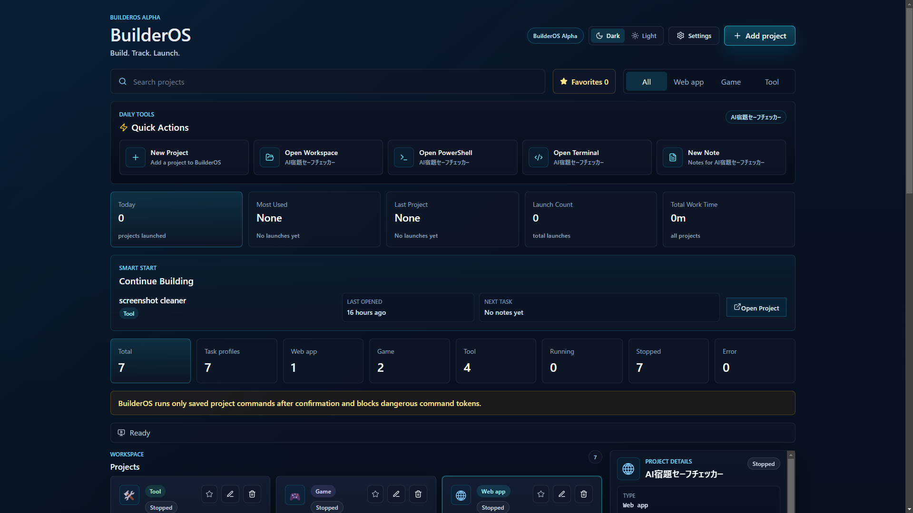
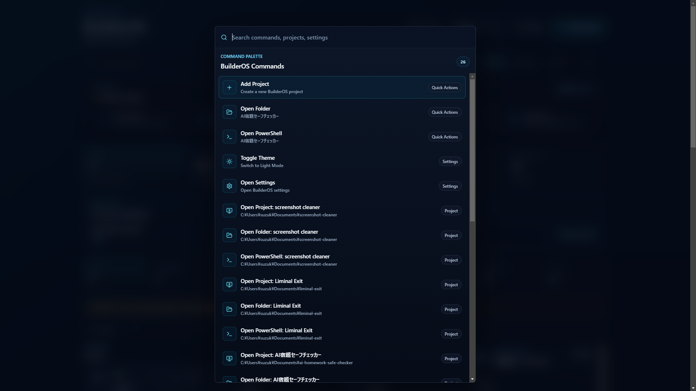
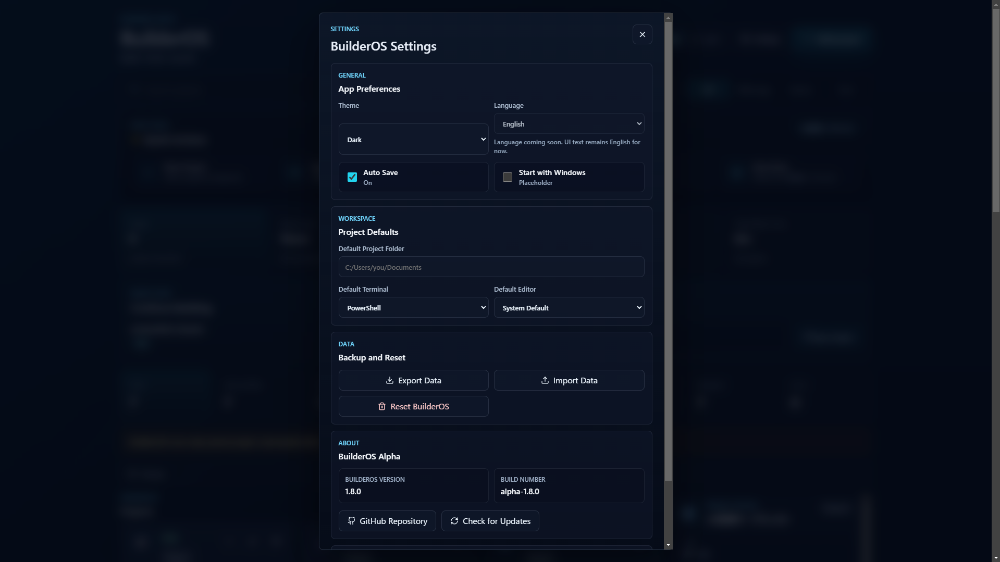
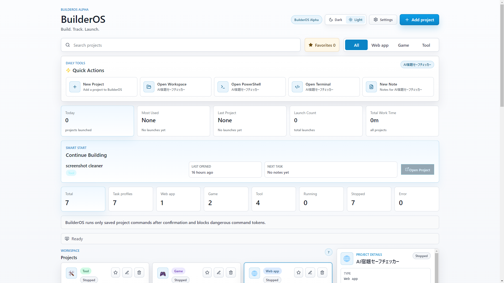

# BuilderOS

**Build. Track. Launch.**

A developer workspace built for solo builders.

---

## Screenshots

| Dashboard (Dark) | Command Palette |
| --- | --- |
|  |  |

| Settings | Light Mode |
| --- | --- |
|  |  |

---

## Features

### Project Management

Keep local projects in one place with paths, project types, task profiles, notes, history, and favorites.

### Quick Actions

Run common actions from the dashboard: add a project, open a folder, open PowerShell, launch a terminal, or jump into notes.

### Smart Start

Resume the project you were last working on without searching through folders.

### Command Palette

Press `Ctrl + K` or `Ctrl + Shift + P` to search and run BuilderOS commands from the keyboard.

Available commands include:

- Open Project
- Open Folder
- Open PowerShell
- Toggle Theme
- Open Settings
- Add Project

### Favorites

Pin important projects and access them from the dashboard or command palette.

### Project Notes

Store lightweight notes beside each project.

### Work Time Tracker

Track active work sessions and total time across projects.

### Theme Toggle

Switch between Dark and Light modes. Your choice is saved locally.

### Settings

Manage preferences, project defaults, data tools, and app metadata.

### Tutorial

Use the first-launch tutorial to add a project, create task profiles, and start launching work.

---

## Installation

BuilderOS is currently built for Windows.

### Windows

Windows builds will be available from GitHub Releases.

### Portable Version

The portable build will not require installation. Place it anywhere on your machine and launch it directly.

BuilderOS stores local app data in Electron's user data folder for the app.

---

## Usage

### Add Project

Click `Add project`, enter a name and folder path, then save it. Add task profiles for common commands.

### Open Project

Select a project card to view details, notes, work time, Git context, logs, and developer tools.

### Use Ctrl + K

Press `Ctrl + K`, search for a project or command, then press `Enter`.

### Favorites

Mark frequent projects as favorites for quick access.

### Theme

Use the header toggle or Settings to switch themes.

---

## Roadmap

* Project templates
* Git workflow automation
* Backup & Sync
* More keyboard-first workflows

---

## Why BuilderOS?

BuilderOS exists to help solo developers move faster with less friction.

Personal projects often spread across folders, terminals, notes, commands, and half-remembered context. BuilderOS brings those daily actions into one focused desktop app.

It was built for one purpose:

> To help individual developers organize and move through daily development faster.

---

## Tech Stack

- Electron
- React
- TypeScript
- Vite

---

## License

MIT
